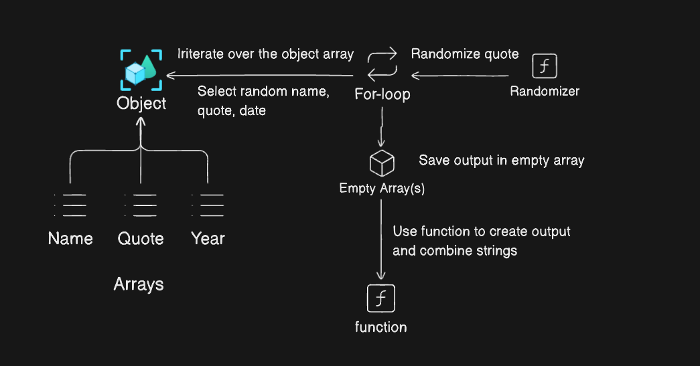

# Random Message Generator - A Codecademy project

The program is part of my fullstack codecademy course.

## Overview

This will be a simple project using Objects, Arrays, and loops to create a program that will output a random message everytime the program is run.
To make the program a bit more funnier, the output will be randomized and might output real or fake quotes from may or may not fake authors.

## Structure

